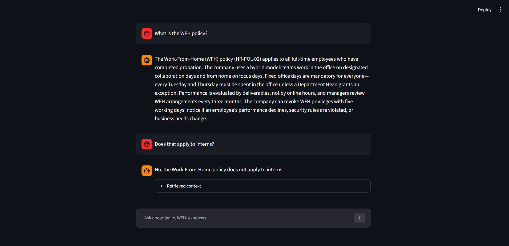

# HR Policy Assistant
 
A retrieval-augmented (RAG) chatbot that answers employee questions from company HR policy documents. It rewrites follow-up questions into standalone queries, retrieves relevant policy chunks, and **declines to answer when the documents don't contain the answer**.
 
> All six policy documents in `data/policies/` are synthetic (written for this project, no real company).
 

 
## Features
 
- **Grounded answers**: the LLM may only use retrieved policy text.
- **History-aware follow-ups**: "Can I carry them forward?" is rewritten to "Can I carry forward my casual leaves?" before retrieval.
- **Two-layer refusal**: a similarity-threshold gate (skips the LLM entirely) plus a strict prompt rule.
- **Retrieval transparency**: the UI shows the rewritten query and the retrieved files with their best similarity scores.
- **Chunk-level evaluation script** that sweeps the similarity threshold and checks refusals and follow-up rewriting.
## Architecture
 
```
OFFLINE (python -m app.ingest)
  policy .txt/.pdf -> recursive chunking (400 chars, 50 overlap)
                   -> MiniLM embeddings (normalized) -> FAISS index on disk
 
ONLINE (per question)
  Streamlit UI -> FastAPI POST /chat
     1. Rewrite follow-up into a standalone question (LLM + last 6 messages)
     2. Embed the question, FAISS top-4 search
     3. Drop chunks below cosine similarity 0.38
          -> nothing left? return "I don't have enough information..." (no LLM call)
     4. Prompt: strict system rules + retrieved context
     5. LLM answers; if it declines, the response is marked grounded=false
     6. Return answer, sources (from retrieval metadata), rewritten query
```
 
## Tech stack
 
| Part | Choice |
|---|---|
| Embeddings | `sentence-transformers/all-MiniLM-L6-v2` (local) |
| Vector store | FAISS |
| LLM | Groq-hosted `openai/gpt-oss-120b` by default (set `GROQ_MODEL` to change); Ollama also works |
| Backend | FastAPI |
| UI | Streamlit |
| Loading/splitting | LangChain community loaders and text splitters |
 
## Run it
 
```powershell
python -m venv env
env\Scripts\Activate.ps1            # macOS/Linux: source env/bin/activate
pip install -r requirements.txt
copy .env.example .env              # macOS/Linux: cp .env.example .env, then add your GROQ_API_KEY
python -m app.ingest                # build the index (not stored in the repo; re-run whenever documents or chunk settings change)
uvicorn app.main:app --reload       # terminal 1
streamlit run ui/streamlit_app.py   # terminal 2
```
 
`.env`:
```
GROQ_API_KEY=your_key_here
GROQ_MODEL=openai/gpt-oss-120b
```
Groq retires models from time to time. If you get a `model_not_found` error, list the models your key can use and update `GROQ_MODEL`.
 
### Docker
 
```bash
docker compose build
docker compose run --rm api python -m app.ingest   # build the index first
docker compose up                                  # UI at http://localhost:8501
```
 
## Evaluation
 
`python -m eval.evaluate` runs 23 in-scope questions (15 used during development, 8 added later as an unseen check) and 10 out-of-scope questions, sweeps the similarity threshold, then runs the full pipeline on the out-of-scope questions and on 5 follow-up pairs.
 
**Chunk-level hit@4:** for each in-scope question, a hit counts only if one of the top 4 retrieved chunks comes from the expected file **and contains the text that answers the question** (for example "24 hours" for the data-breach question). Matching on the file alone would overstate retrieval quality (see "What I found" below).
 
Results with the final settings (chunk size 400, overlap 50, all 23 in-scope questions):
 
| Threshold | hit@4 | False refusals | Out-of-scope declined (similarity alone) |
|---|---|---|---|
| 0.20 | 100% | 0% | 40% |
| 0.25 | 100% | 0% | 50% |
| 0.30 | 100% | 0% | 50% |
| 0.35 | 96% | 4% | 60% |
| 0.40 | 96% | 4% | 70% |
| 0.45 | 96% | 4% | 90% |
| 0.50 | 87% | 13% | 100% |
 
At the chosen threshold of 0.38, chunk-level hit@4 was **22 of 23** questions, and **7 of 8** on the unseen questions. The one miss ("What is the mileage rate if I use my own car for work?") is a vocabulary mismatch: the policy says "personal vehicle" and "per km". The correct chunk ranked first (similarity 0.341, next best 0.211) but fell below the 0.38 threshold, so the bot refuses this question. I kept the threshold at 0.38 instead of tuning it to fix this case.
 
**End-to-end** (threshold 0.38, LLM included, one run at chunk size 400): 10/10 out-of-scope questions declined and 5/5 follow-up rewrites passed.
 
### Chunk size comparison (15-question development set)
 
| Threshold | 800 / 100: hit@4, false refusals, OOS declined | 400 / 50: hit@4, false refusals, OOS declined |
|---|---|---|
| 0.35 | 100%, 0%, 60% | 100%, 0%, 60% |
| 0.40 | 93%, 0%, 70% | 100%, 0%, 70% |
| 0.45 | 93%, 7%, 80% | 100%, 0%, 90% |
| 0.50 | 80%, 20%, 100% | 93%, 7%, 100% |
 
At the chosen threshold of 0.38, chunk-level misses on this set went from 1 of 15 questions (800/100) to 0 of 15 (400/50).
 
### What I found
 
1. **File-level evaluation hid a retrieval miss.** My first evaluation counted a hit whenever the expected *file* appeared in the top 4, and reported 100% hit@4. A manual check of 8 answers against the source files found 7 correct and 1 false refusal: the bot declined "How quickly must a data breach be reported?" although the policy says 24 hours. Printing the retrieved chunks showed why: with 800-character chunks, the correct chunk scored 0.361, just below the 0.38 threshold, while an unrelated "Disciplinary process" chunk scored 0.428. Switching the evaluation to chunk-level matching exposed the miss, and reducing chunk size to 400 characters fixed it: all 15 development questions retrieve a chunk containing their answer at thresholds up to 0.45, and 7 of 8 unseen questions did at 0.38.
2. **Similarity thresholds cannot reject questions that sound like HR.** Questions such as "What is the dress code?" or "What is the salary band for Grade L3?" score as high as real answers. Rejecting all 10 out-of-scope questions by similarity alone required 0.50, which wrongly rejected valid questions (13% of the 23 at 400/50, and 20% of the original 15 at the larger chunk size). The threshold therefore only filters clearly unrelated questions cheaply; the prompt rule catches the rest.
3. **A fixed threshold is brittle.** In the mileage case the right chunk ranked first by a wide margin but scored just under the cutoff, so a rank- or margin-based rule might do better. I haven't tested one.
4. **Manual re-check after the chunk-size change:** 9 of 9 answers correct in the UI (fresh session per question), including the data-breach question that was previously refused; its best-matching chunk now scores 0.746. These 9 questions reuse the wording of the development set, so this is not a blind test.
## Limitations
 
- Synthetic corpus of six documents. The evaluation questions were written by the author after reading the documents, so hit@4 is likely optimistic compared with real user queries.
- The chunk-size change was chosen after the data-breach failure surfaced on the same development questions, so that improvement is not independently validated (the 8 later questions partly check it). Only two chunk sizes were compared.
- Small evaluation set (33 questions: 23 in-scope and 10 out-of-scope, plus 5 follow-up pairs). Results come from one embedding model and one LLM configuration, and LLM output can vary between runs.
- The chunk-level check looks for a hand-chosen text snippet in the retrieved chunks. It does not check answer wording. The follow-up check only verifies that a keyword from the earlier topic appears in the rewritten question.
- Semantic retrieval can fail when a question uses different words from the policy ("mileage" versus "per km"). Query expansion, such as generating several rewordings of the question and merging the results, would be the next thing to try.
- Broad questions are answered incompletely, because only the top 4 small chunks reach the model. In a manual check, "What is the WFH policy?" covered 1 of 5 key points (it left out the 2-days-per-week rule, the intern exclusion, and the request form), while "What are the rules for requesting work from home?" covered 4 of 5. Everything the bot stated was correct; the gap is completeness. The same omission of the 2-days-per-week rule appeared earlier with 800-character chunks, so chunk size is not the only cause. Retrieving more chunks for broad questions is untested.
- The query rewriter sometimes copies extra detail from the chat history into the new question. Retrieval still worked in the tested cases.
- Chat sessions are stored in memory (lost on restart, unbounded growth). A production version would use Redis or a database.
- No authentication or rate limiting.
## Project structure
 
```
app/             ingest.py (index building), rag.py (rewrite, retrieve, answer), main.py (FastAPI)
ui/              streamlit_app.py
eval/            evaluate.py
data/policies/   synthetic policy documents
```